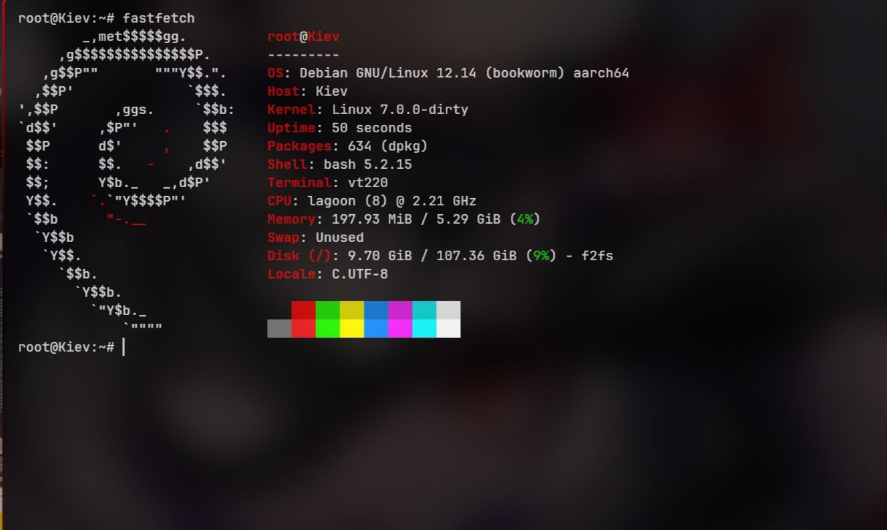

# Motorola Kiev (Moto G 5G) - Mainline Kernel Support

This repository contains the ongoing work to bring mainline Linux kernel support to the Motorola Kiev (Moto G 5G), based on the Qualcomm SM7225 (Snapdragon 750G) SoC.

## Current Status

| Component | Status | Notes |
|-----------|--------|-------|
| **CPU** | OK | 8 cores functional, Kryo 570 compatible. |
| **UART** | OK | `uart9` (ttyMSM0) @ 115200n8. Critical for debugging. |
| **UFS** | OK | Storage functional. |
| **RPMh** | OK | Regulators managed via RPMh hardware. |
| **USB PHY**| OK | QMP/QUSB2 PHYs probing correctly. |
| **USB Ctrl**| WIP | Controller registered but pending sync_state. |
| **Display**| Unsupported | Bringup performed with screen/battery disconnected. |

## Important: Barebone Bringup
Most of the current development has been performed in **"Barebone Mode"**:
- Screen disconnected.
- Battery disconnected (powered via USB/DC).
- Debugging strictly via UART (1.8V).

## 🛠 Prerequisites

1. **Unlocked Bootloader**: Mandatory.
2. **UART Access**: Highly recommended. Connect to UART testpoints (1.8V). TX and RX are both required to see ABL logs and interact with the shell.

##  How to Build & Flash

Detailed instructions for building the kernel and DTBO, and packaging them into a `boot.img`, can be found in [DEVELOPMENT.md](DEVELOPMENT.md).

##  Call for Collaboration
The project has reached a point where expert help is needed for:
- **SMMU**: Enabling and fixing memory mapping violations.
- **USB Controller**: Debugging the `sync_state` and power rail sequencing.
- **Interconnects**: Proper bandwidth management definition.
- **GPIO/Pinctrl**: Mapping volume/power buttons and remaining peripherals.

If you are a kernel developer with experience in Qualcomm SoCs, your help would be invaluable!

##  License
- Device Tree files are licensed under `BSD-3-Clause OR GPL-2.0`.
- Documentation is licensed under `CC-BY-4.0`.
